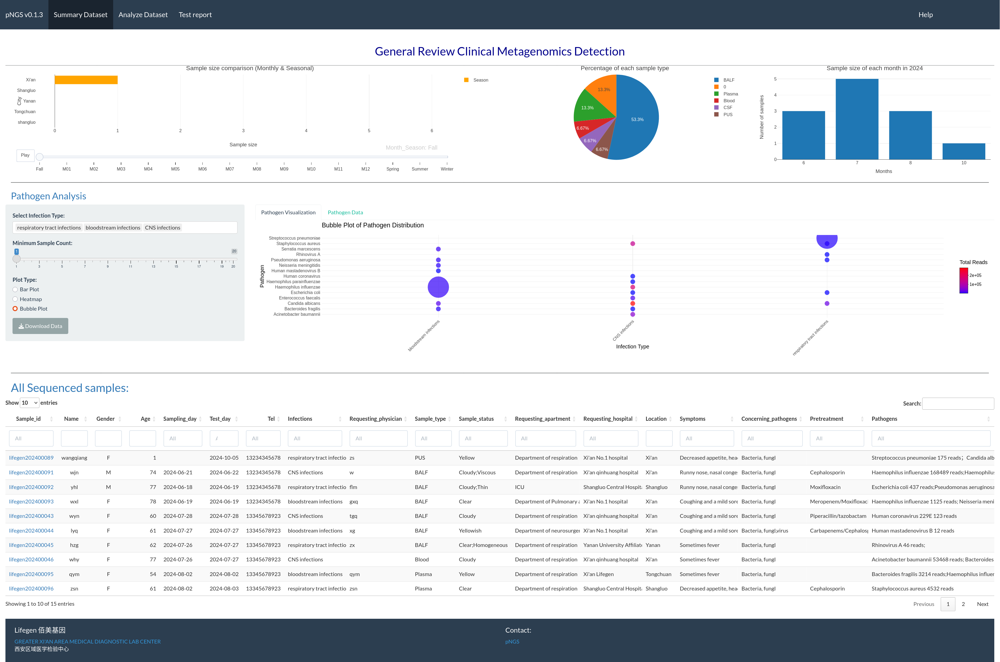
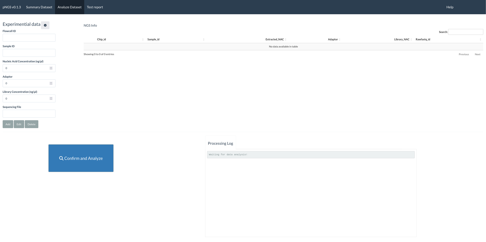
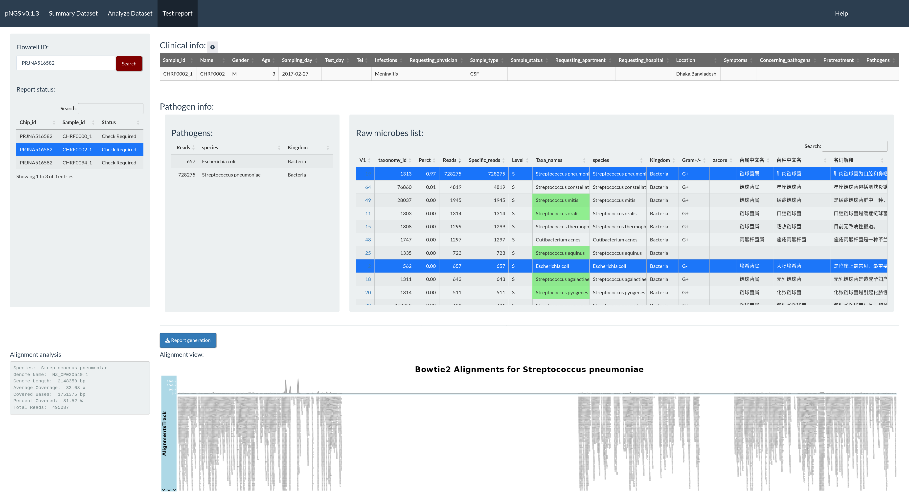

# RpNGS: An automated platform for pathogen identification and monitoring in clinical metagenomics data


# Summary

RpNGS is a novel, user-friendly standalone application capable of storing lab data (reagent, primer, contaminant and run configuration), managing clinical metadata, processing FASTQ files and generating analysis and comparative reports (including Word reports) that can be easily reviewed and certified. Its interactive design requires no programming skills, making it a valuable tool for clinical metagenomic pathogen identification. 

## The general workflow is described in below.

**1. Summary_module**



The summary tab (Fig.1a) empowers users to visually analyze the accomplished mNGS test. The interactive visualization choice is a map, pie chart, and bar plot to illustrate the sales volume among locations, percentage of each sample type and samples size distribution between months in one year, respectively. We also use bar,heatmap, and bubble plot to illustrate the Pathogens distribution among infection types. RpNGS use main data table to display detail information of processed mNGS test for feasible searching and double checking the clinical reports.

**2. Analysis_module**




In RpNGS second tab (Fig.1b), the trained experimenter should update the information of each batch including flow cell id, sample id, nucleic acids concentration after extraction and library preparation steps, adaptor id, and file name of sequencing data. Then start the process step by click the process button. 

**3. Report_module**




The third tab (fig.1c) shows clinician or certified user, manually decide the pathogen for specific patient from microbes list based on multiple factors such as z-scores, mapped reads, average coverage for a specific pathogen, gender, age, sample types, clinical concerned pathogens types, anti-infection treatment. 


# Get started

## Set up the environment

### Install conda packages
```bash
# Create fastp conda environment
conda create --name fastp
conda activate fastp
# As combined commands: 
conda install -c bioconda fastp bowtie2 kraken2 bracken 
# Install fastp [1] 
conda install bioconda::fastp
# Install bowtie2 [2] 
conda install bioconda::bowtie2
# Install kraken2 [3] 
conda install bioconda::kraken2
# Install bracken [4] 
conda install bioconda::bracken

```
### Create working directory
```bash
# Create reference_database folder
mkdir reference_database
cd reference_database
# Create folder for bowtie2 database 
mkdir bowti2_index_db
# Create folder for kraken2+bracken database
mkdir kraken_bracken_db
```
### Set up reference database
For bowtie2 database, user should download reference genome fasta data and run below code for building bowtie2 index
```bash
bowtie2-build -f genome_name.fna genome_name
```
For kraken2+bracken database, user can download from their website https://benlangmead.github.io/aws-indexes/k2

Note: You may use a customised reference database. It is however strongly recommended to avoid draft or low-quality reference genomes and use complete sequences of circular microorganisms only.

### 

## To run Shiny app:

Open Rstudio, and run below command 
```R
library("shiny“）
runGitHub(repo = "RpNGS",username="mj200921059",ref = "main",subdir="RpNGS.R")
```
